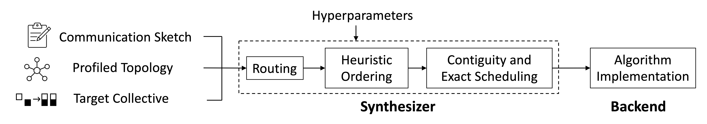

# TACCL: Guiding Collective Algorithm Synthesis using Communication Sketches

<div align="center">

</img></div>


> **TACCL: Guiding Collective Algorithm Synthesis using Communication Sketches** <br/>
> Aashaka Shah, Vijay Chidambaram, Meghan Cowan, Saeed Maleki, Madan Musuvathi, Todd Mytkowicz, Jacob Nelson, Olli Saarikivi, Rachee Singh <br/>
> **NSDI 2023** [https://arxiv.org/pdf/2111.04867.pdf]

TACCL is a tool to generate algorithms for collective communication like AllGather, AllToAll, and AllReduce for any given hardware configuration. TACCL takes a human-in-loop approach to algorithm design in which a user provides _communication sketches_ to guide the synthesis process. TACCL outputs TACCL-EF, an execution format that contains the schedule of GPU data transfers to efficiently implement the target collective. TACCL's schedules can be run by registering TACCL-EF files using the [MSCCL](https://github.com/microsoft/msccl-tools) tool stack.


## Installation
We use Gurobi to solve the optimization problem. Please obtain a [Gurobi license](https://www.gurobi.com/downloads/) online and then proceed to install the Gurobi licensing tools as follows.
Within an anaconda environment, run:
```
conda config --add channels http://conda.anaconda.org/gurobi
conda install -c conda-forge gurobi -y
<command to add Gurobi license>
```
Finally, run
```
pip install .
```


## Usage

### Generating the algorithm
To generate data transfer algorithm for a collective <coll> for a specific topology <topo>, please provide a topology file <topo-file.json> containing profiling information of links in the node and a sketch file <sketch.json> specifying the communication sketch. Using these, a JSON file of data transfer steps for the collective algorithm can be generated with the following command:

```
$ taccl solve <topo> <coll> --topology-file <topo-file.json> --sketch-file <sketch.json> -o <output.json>
```

For example, in order to generate an algorithm for Allgather used in the Evaluation for _dgx2-sk-1_, we run the following command:
```
$ cd taccl/examples
$ taccl solve DGX2 Allgather --topology-file ../taccl/examples/topo/topo-dgx2-1MB.json --sketch-file ../taccl/examples/sketch/sk1-dgx2-n2.json
```

To generate schedules for the combining collective AllReduce, we first obtain an AllGather algorithm and use it to generate the AllReduce algorithm. <ts> is the timestamp that is used to save the send_dict of AllGather algorithm and can be obtained from the suffix of the json algorithm file.
```
$ cd taccl/examples
$ taccl solve DGX2 Allgather --topology-file ../taccl/examples/topo/topo-dgx2-1MB.json --sketch-file ../taccl/examples/sketch/sk1-dgx2-n2.json
$ taccl combine DGX2 Allgather --topology-file ../taccl/examples/topo/topo-dgx2-1MB.json --sketch-file ../taccl/examples/sketch/sk1-dgx2-n2.json --ts <ts>
```

`./commands.sh` shows the commands with sketches and profiled topologies that can be used to obtain the results in our paper.


#### Providing topology
- "\<topo\>" should be selected from the 'known_topologies' constructor and can be either of "custom", "HubAndSpoke", "DGX2", or "NDv2". `./taccl/topologies/generic.py` defines the link connection matrix within a node for each \<topo>. `links[dst][src]` is 1 if there is one link going from `src` to `dst`.
- "\<topo-file.json\>" contains profiling information about the node, like latency and bandwidth costs of intra-node and inter-node transfers as well as number of GPUs and NICs in the node. Depending on the profiling information given in the topology-file provided by the user, the profile attributes `alpha`, `betas`, `invbws`, `nics_per_node`, `remote_invbw`, `remote_alpha`, and `remote_beta` are used to obtain a NodeTopology object. `taccl/examples/topo` directory gives examples of topology files for DGX-2 and NDv2 nodes that can be provided to `--topology-file`.

You can add new node topologies as a separate function in `./taccl/cli/known_topologies.py` or use the "custom" option for topologies and provide all details of the topology in the user-provided topology-file.

#### Providing communication sketch
A communication sketch has the following three purposes:
1. Create a logical topology that determines how different nodes are connected to each other
2. Annotate links which form a switch
3. Annotate symmetry planes in the topology

`./taccl/examples/sketch` directory gives examples of some communication sketches that can be used for NVIDIA DGX-2 and Azure NDv2 nodes.

### Lowering to TACCL-EF
Once the algorithm is generated, we lower it into a TACCL-EF file. The number of instances \<instances> determines the multiple we will use to increase the number of channels that are used to perform sends and receives. When there are already many threadblocks being used per GPU, you should use a single instance for the best performance.
```
$ taccl ncclize <output.json> --instances <instances>
```

### Running with MSCCL
The TACCL-EF file can be used as input by the [MSCCL runtime](https://github.com/microsoft/msccl) to actually run the algorithm on the hardware. Please follow the setup instructions in the MSCCL repository to run TACCL algorithms. Once MSCCL is setup, TACCL-EF files can be benchmarked using nccl-tests as follows:
```
$ mpirun -np <ngpus> -x LD_LIBRARY_PATH=msccl/build/lib/:$LD_LIBRARY_PATH -x NCCL_DEBUG=INFO -x NCCL_DEBUG_SUBSYS=INIT,ENV -x MSCCL_XML_FILES=<taccl-ef> -x NCCL_ALGO=MSCCL,RING,TREE  nccl-tests/build/<nccl-test-binary> -b 128 -e 32MB -f 2 -g 1 -c 1 -n 100 -w 100 -G 100 -z 0
```
TACCL-EF files can also be registered in the [MSCCL-toolkit](https://github.com/microsoft/msccl-tools) to be used in frameworks like PyTorch and Tensorflow.

## Guide to providing topology profiles
[INPUT_GUIDE.md](./INPUT_GUIDE.md) provides more details of how to specify different profiles for topologies.


## Citation
> Shah, A., Chidambaram, V., Cowan, M., Maleki, S., Musuvathi, M., Mytkowicz, T., Nelson, J. and Saarikivi, O., 2023. {TACCL}: Guiding Collective Algorithm Synthesis using Communication Sketches. In 20th USENIX Symposium on Networked Systems Design and Implementation (NSDI 23) (pp. 593-612).

## Contributing

This project welcomes contributions and suggestions.  Most contributions require you to agree to a
Contributor License Agreement (CLA) declaring that you have the right to, and actually do, grant us
the rights to use your contribution. For details, visit https://cla.opensource.microsoft.com.

When you submit a pull request, a CLA bot will automatically determine whether you need to provide
a CLA and decorate the PR appropriately (e.g., status check, comment). Simply follow the instructions
provided by the bot. You will only need to do this once across all repos using our CLA.

This project has adopted the [Microsoft Open Source Code of Conduct](https://opensource.microsoft.com/codeofconduct/).
For more information see the [Code of Conduct FAQ](https://opensource.microsoft.com/codeofconduct/faq/) or
contact [opencode@microsoft.com](mailto:opencode@microsoft.com) with any additional questions or comments.

## Trademarks

This project may contain trademarks or logos for projects, products, or services. Authorized use of Microsoft 
trademarks or logos is subject to and must follow 
[Microsoft's Trademark & Brand Guidelines](https://www.microsoft.com/en-us/legal/intellectualproperty/trademarks/usage/general).
Use of Microsoft trademarks or logos in modified versions of this project must not cause confusion or imply Microsoft sponsorship.
Any use of third-party trademarks or logos are subject to those third-party's policies.